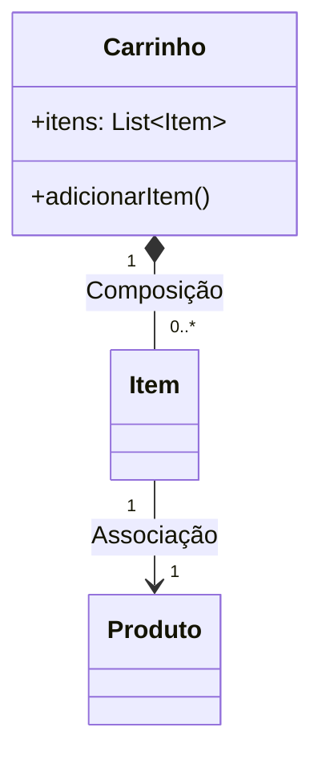

# Aula de POO: Relacionamentos Entre Classes em Java

## Índice
- [Aula de POO: Relacionamentos Entre Classes em Java](#aula-de-poo-relacionamentos-entre-classes-em-java)
  - [Índice](#índice)
  - [Introdução](#introdução)
    - [Conceitos Fundamentais](#conceitos-fundamentais)
    - [Taxonomia de Relacionamentos:](#taxonomia-de-relacionamentos)
  - [Tipos de Relacionamentos](#tipos-de-relacionamentos)
    - [Associação](#associação)
    - [Agregação](#agregação)
    - [Composição](#composição)
    - [Dependência](#dependência)
  - [Exercício Prático](#exercício-prático)
  - [Conclusão](#conclusão)
    - [Diagrama Síntese](#diagrama-síntese)
    - [Checklist de Verificação](#checklist-de-verificação)

---

## Introdução

### Conceitos Fundamentais
```java
// Exemplo motivador
class Carro {
    Motor motor;  // Relacionamento!
    // ...
}
```

**Pergunta-chave:**  
*"Como objetos colaboram entre si em um sistema OO?"*

### Taxonomia de Relacionamentos:
| Tipo          | Símbolo UML | Descrição                  |
|---------------|------------|----------------------------|
| Associação    | ───────     | Conexão básica entre objetos |
| Agregação     | ──◇──       | "Tem-um" (parte independente) |
| Composição    | ──◆──       | "Tem-um" (parte dependente)   |
| Dependência   | ╌╌╌╌╌>     | Uso temporário              |

---

## Tipos de Relacionamentos

### Associação
**Código Java:**
```java
class Professor {
    void ministrar(Disciplina d) {  // Associação
        System.out.println("Ministrando " + d.getNome());
    }
}
```

**Características:**
- Relação mais simples
- Objetos têm ciclos de vida independentes
- Pode ser bidirecional

### Agregação
**Código Java:**
```java
class Departamento {
    List<Professor> professores;  // Agregação
    
    void addProfessor(Professor p) {
        professores.add(p);
    }
}
```

**Regra de Ouro:**  
*"Se o departamento for deletado, os professores continuam existindo."*

### Composição
**Código Java:**
```java
class Computador {
    CPU cpu;  // Composição
    
    Computador() {
        this.cpu = new CPU();  // Criado junto
    }
}
```

**Key Point:**  
*"CPU não existe sem o Computador!"*

### Dependência
**Código Java:**
```java
class Relatorio {
    void gerar(PDFFormatter formatter) {  // Dependência
        formatter.format(this);
    }
}
```

**Quando usar:**  
- Passagem de parâmetros
- Retorno de métodos
- Chamadas temporárias

---

## Exercício Prático

**Cenário:** Modelar um sistema de e-commerce

```java
class Carrinho {
    // TODO: Implementar agregação com ItemCarrinho
}

class ItemCarrinho {
    // TODO: Implementar associação com Produto
}

class Pagamento {
    // TODO: Implementar dependência com GatewayPagamento
}

class Pedido {
    // TODO: Implementar composição com NotaFiscal
}
```

**Desafios:**
1. Qual relacionamento usar para `Carrinho` e `ItemCarrinho`?
2. Como implementar a relação entre `Pedido` e `NotaFiscal`?

---

## Conclusão

### Diagrama Síntese


### Checklist de Verificação
- [ ] Entendi as 4 formas de relacionamento
- [ ] Sei implementar cada uma em Java
- [ ] Consigo identificar em sistemas reais